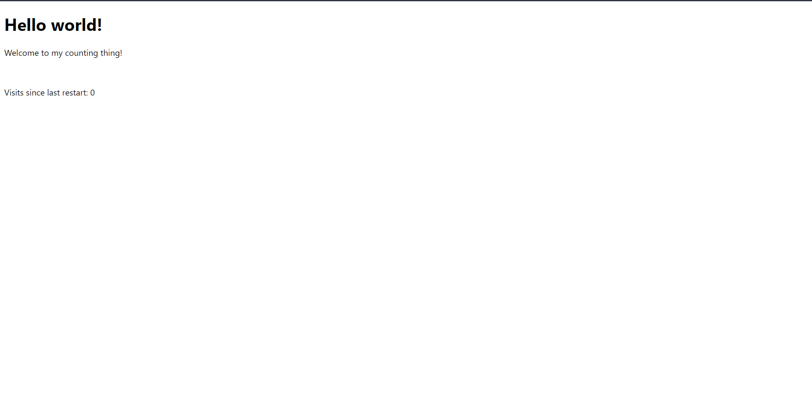
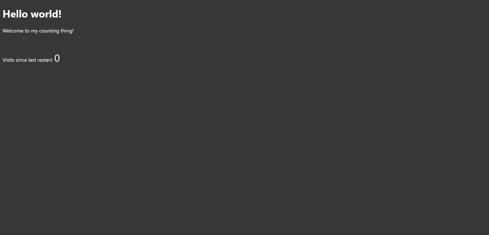

## Fore-word - Welcome! 👋
Recently, after enjoying doing lots programming, I soon found myself wanting to branch out into the wider world - the internet! However, on a tight budget, I soon found this very difficult.
After *lots* of research, I found it very hard looking for ways to set up a website _on my own_ that didn't involve sketchy free trials. I also knew that for the website I wanted to host, I'd need a server backend, but very few services actually provide this without it becoming _serverless_. I knew would have to self-host on a small computer located at home. 

## What is this guide?
This guide aims to help guide you step-by-step to making a dynamic website at home! We'll cover:
- Creating the website server and pages
- Going public
- Giving your website a good name (and URL)
- Securing with https 

Note that you *will* be coding, as it allows for much more flexibility than the no-code versions. If you *do* want a no-code website, you should use an online service. [Google Sites](https://sites.google.com) is a good, free, solution.

## Stuff you need before you start
- A brain 🧠
- Basic knowledge on HTML/CSS/Javascript (I'll explain what all the code means. It'll be useful when actually making your website content though!)
- A network connection (you will need admin access to the router)
- A computer that can connect to said network (You will also need admin access. Plus, this should ideally able to stay at home)'
- An email address
- Node.JS and NPM installed (These should come together with most installations - https://nodejs.org/en)
- An IDE/Text Editor installed (Any will do - Even windows notepad is fine!)

<br><br>
❗**Top tip:** Get lost in any of the code along the way? You can check it against the **Code Dump** using the folders above.

# Lets begin! 😄

## 1. Creating the Website
Before we get you onto the internet, we will start by making the actual website. Please note that you can edit this later! In this example, we will be creating a website that counts how many visits it has had. We will save this to a file, and display it when someone visits it!

### The file structure
Begin by creating a folder for your website somewhere on your computer (E.G The Documents folder). Inside that, create the following files (they can just be empty for now):

```
Your folder/
├── public/
│   ├── index.html
│   ├── styles.css
│   └── scripts.js
└── server.js
```

Our public folder will host all of the files that we need to serve - This will show all the nice pretty stuff! The `server.js` file will be what then sends it to the network!<br><br>
In this guide, I'll indicate what file everything goes in, and what it does. If you're interested in how it works, read the comments in the code snippets (They begin with a `//` in javascript, are surrounded by `/* */` in CSS, or `<!-- -->` in HTML)!<br><br>
**Lets Begin coding!**<br>

### 1️⃣ **Create the page that displays the counter - Copy the following into `public/index.html`**
```html
<!-- Define the document type -->
<!DOCTYPE html>
<!-- Set the language attribute -->
<html lang="en">
<!-- Header stuff, like including the styles.css file -->
<head>
  <meta charset="UTF-8">
  <meta http-equiv="X-UA-Compatible" content="IE=edge">
  <meta name="viewport" content="width=device-width, initial-scale=1.0">
  <!-- The title is what is displayed in the header bar in the browser -->
  <title>The Counter thing!</title>
  <!-- The link tag allows us to link the CSS File which makes everything look nice :) -->
  <link rel="stylesheet" href="./styles.css">
  <!-- Lets import the JavaScript file.
       The SRC attribute allows us to pick it from a file
       The ./ means "Go to the folder this file is currently in".
  -->
  <script src="./scripts.js"></script>
</head>
<!-- The main page content. The class attribute helps with CSS later -->
<body class="background">
  <!-- h1-5 represents a header -->
  <h1>Hello world!</h1>  
  <!-- p represents a paragraph -->
  <p>Welcome to my counting thing!</p>
  <!-- br represents a Line Break (new line) -->
  <br />
  
  <!-- You can stick elements in elements too! -->
  <p>Visits since last restart: 
    <!-- p elements can go multiline, but don't display newlines unless you put a "<br />" in them
         span elements don't represent anything, and take their style from what they're inside
         The id="count" is an attribute, that we will use in our javascript later
         It's got a "0" in as that will be the default value. The JS will change this when we add it in.
    -->
    <span id="count">0</span>
  </p>
</body>
</html>
```

You can now open this file in your browser! It should look something like this:


Hmm, looks kind of... Basic. Plus it's not dark-mode friendly; it's so bright! Lets make it look a bit nicer. <br><br>
### 2️⃣ **In the `/public/styles.css` file, add this code in:**

```css
/* In CSS, we use this syntax! 
element {
  thing-to-change: value;
}
*/

/* This sets any HTML elements with the tags <h1></h1> or <p></p>
We'll change the colour of the text inside them to white
By the way, if you're British like me, CSS spells color the American way. */
h1, p {
  color: white;
}

/* White-on-white doesn't work. Lets set the background colour too. The grey #373737 looks good!
We set this to any elements with the class attribute set to "background"
Note that . refers to a class. */

.background {
  background-color: #373737;
}

/* Make the visit count BIG 
Note that # refers to an ID. */
#count {
  font-size: 32px;
}

/*There are loads of things we can change in CSS. It's very complex and out of the scope of this tutorial though, so do some research! Google is your friend! */
```


Yes! That's much easier on the eyes! But it still doesn't do anything yet.<br><br>
### 3️⃣ **Lets make that counter work.** We'll need to head out into the `server.js` file, and copy the following.

```js
// We're working with the server functions
// This brings a library into our code which we will install later!
// ExpressJS is used to route all our requests.

// Variables in javascript begin with "const", "let" or "var". 
// Note semi-colons are used to tell it when we're moving to a new line.
let express = require("express");
let app = express();

// We can use the express.static() function which quickly gives us everything in the /public folder
app.use("/", express.static("public"));

// We can also make our own paths which do stuff when we make a request to it!
// For example, lets make our counter endpoint!
// Create a variable that stores how many visits we have had
let visits = 0;
// Create a function which takes a request and response object 
function incrementCounter(request, response) {
  // The ++ adds 1 to the variable
  visits++;
  // Send the variable back with a status of 200
  // The status is 200 since it's OK. This is similar to those 404 errors you get, but the express library handles those for us :D
  response.status(200).send(visits.toString());
  // And we're done!
}

// Now recieve "GET" requests at "/counter" (The standard HTTP request you use to access webpages like google) 
app.get("/counter", incrementCounter);

// [We're going to insert more code here later!]

// We'll listen on port 3000 - More about this later
// We can also pass a function, so I've added one that tells us 
// when it's ready for listening!
app.listen(3000, function() {
  console.log("Listening on port 3000!")
});
```
Great! We now have created our server and made a functional counter! <br>
**Note:** Our counter has been made so it resets every time we restart our server. It is possible to save stuff with these scripts, but can also pose a security threat if not done properly, so I haven't included it in this tutorial :)<br><br>
### 4️⃣ **Install libraries and test the server**<br><br>
  Head to your Operating System's terminal or Command Prompt (**Tip:** In windows, you can press `Windows Key + R`, type `cmd` and hit enter to get to it quickly!)<br><br>
  You need to be in the folder with `server.js` in it, but you may find yourself in your user folder (E.G In windows `C:/Users/YourName/`). Most OS's follow this command set:
- Use the `cd [Folder]` command to navigate into the next folder
- Use `cd ..` to go back a folder
- Use `dir` to view the contents of your current folder
```
C:/Users/Bob> cd Documents
C:/Users/Bob/Documents> cd Website
C:/Users/Bob/Documents/Website> 
```
Once in the correct folder, run `npm init -y`. This will add a `package.json` file in your folder, which will contain some basic information about it.
```
C:/Users/Bob/Documents/Website> npm init -y
Wrote to C:\Users\Bob\Documents\Website\package.json:

{
  "name": "Website",
  "version": "1.0.0",
  "description": "",
  "main": "index.js",
  "scripts": {
    "test": "echo \"Error: no test specified\" && exit 1"
  },
  "keywords": [],
  "author": "",
  "license": "ISC"
}

C:/Users/Bob/Documents/Website> 
```
🙋‍♂️**FAQ:** "Help! It says "npm" isn't a command!" - Don't worry! You haven't got `npm` installed! It should install with `node.js` which you should've installed earlier. Check out [this guide](https://docs.npmjs.com/downloading-and-installing-node-js-and-npm#using-a-node-installer-to-install-nodejs-and-npm).<br><br>
Now we have established our folder, we can install the `express` library! Do so with `npm install express`.
```
C:/Users/Bob/Documents/Website>npm install express
added 58 packages, and audited 59 packages in 3s

0 packages are looking for funding
  run `npm fund` for details

found 0 vulnerabilities
C:/Users/Bob/Documents/Website>
```
You should now have a few extra files, so your folder should look like this:
```
Your folder/
├── public/
│   ├── index.html
│   ├── styles.css
│   └── scripts.js
├── node_modules/
│   └── [Various library folders in here...]
├── server.js
├── package.json
└── package-lock.json
```
Now with the library installed, we can run it! Try it with `node server.js`. After a moment, it should say `Listening on port 3000!`

```
C:/Users/Bob/Documents/Website>node server.js
Listening on port 3000
```
🙋‍♀️**FAQ**: "Help! How do I get out?" Hit `Ctrl+C` (without anything selected) to escape. Note you'll stop the server by doing this.<br><br>
🙋‍♂️**FAQ:** "It's asking to allow access through my firewall!" You should be able to just press cancel. Since it's just running on your home network, it isn't accessible to the outside world, so should be fine for now. We will check this later in this tutorial.<br><br>
With the server running, you can now visit it in your web browser **but** this time we'll head to the server's web address. *Where is that?*<br><br>
You need to find your local IP address. You can google it, but here's where you can find it in a few OS's: 

- In Windows 10+, it can be found in the WiFi properties at the IPv4 section
- In Linux, run `ip -4 addr` in the command line
- In MacOS, run `ifconfig | grep "inet " | grep -v 127.0.0.1` in the command line

In the above, look out for the local IP address. It should look something like `192.168.0.100` but they vary (They should always begin with `192.168.`)!<br><br>
🙋‍♀️**FAQ:** "Help! I can't find my IP address!" Often google will be your friend! Try researching - There's loads of ways to find it, and the above methods are just examples of one of each. <br><br>
Once you've found it, use the browser to view `http://<YOUR IP>:3000` (E.G `http://192.168.0.100:3000`) and you should see your site!<br><br>

But oh no! The counter doesn't go up! 😔<br>No worries; lets add that now!

### 5️⃣ **Add some functionality to the main webpage.** Head into the `/public/scripts.js` file and copy the following:
```js
// Set our async function to load when the HTML ready
// The async stands for asynchronously - This allows for us to
// pause the function whilst parts are completed. 
window.onload = async function () {
  // Grab our <span> element using the ID we got earlier.
  // NOTE: In HTML IDs can only be matched to one element,
  // otherwise we get errors :)
  let counterElement = document.getElementById("count");

  // Now we need to make the request to our /counter endpoint!
  // We use a built-in function called "fetch()" to do this
  // Since it takes some time, we add the "await" on, which the "async" above allows us to do.
  let response = await fetch("/counter");

  // We have a response, but we need the data we sent!
  // To get it, we use the response.text() which needs an await
  let visitCount = await response.text();

  // Awesome! We now have the number in our visitCount variable!
  // Now we need to display it. We can set it as the text inside
  // the <span> variable we got earlier!

  // innerText is a property (like a variable), 
  // so we set it with an equals sign
  counterElement.innerText = visitCount;
}
```
Now head back to your terminal. Hit `Ctrl+C` to stop the server. Then start it again.

```
Listening on port 3000
^C
C:/Users/Bob/Documents/Website>node server.js
Listening on port 3000
```

Heading back to the webpage (It'll want a refresh), the counter now works! Refresh it a few times and you should see the counter go up!

### 6️⃣ Customize!
Head back to the files in the `public` folder, and change them up! Have fun and make the website *your website* and not just a random visitor counter website. This tutorial barely touches on what you can do with HTML, JS and CSS!<br><br>
Good learning resources include (but are not limited to):
- [W3Schools](https://www.w3schools.com/)
- [GeeksForGeeks](https://www.geeksforgeeks.org/html/)
- [Google Search](https://www.google.com/) (Or whatever search engine you prefer)<br><br>
## 2. Going Public
You may have noticed that visiting the page on your phone also works, but only while you're on the same WiFi network, which isn't ideal.<br><br>
In this section of the tutorial, we'll go through how to allow access to your website *outside* of your home network!<br><br>
⚠️**Important Notes:**

- You can only host one website per port per network. 
- You will need **Administrator Access** to the router. 
- You'll need to be able to change your firewall settings. More on this later!
### How do we get it public?
This section of the tutorial will involve working with the **Router**. By default, the router blocks all requests into your home network (that would be a massive security issue). However, we can allow *some* routes in to stop any bad requests, but keep it safe and secure!
<br><br>
We do this with **Port Forwarding**. As you probably saw before, we listened to our website through port 3000, and connected to it through `http://YourIp:3000` (the 3000 at the end is the port). The port is what allows us to connect to the server!<br><br>Port forwarding allows us to pick ports to allow inbound requests through the router! 

### 1️⃣ **Log into your router**
Access your router through your browser (typically at `http://192.168.0.1`). You'll need to enter the admin password to access the settings

### 2️⃣ **Locate the Port Forwarding settings**
❗**Note:** Routers come in different shapes and sizes, and their software tends to be different too. There isn't any standard, but look for "Port Forwarding", which is usually in the security section.

### 3️⃣ **Forward the new port**
In your Port Forwarding settings, add a new configuration. Use the below settings and add your IP address (same as the one you used to connect to the website).
| **Parameter**           | **Input**            |
|-------------------------|----------------------|
| **IP Address**          | Your IP (192.168...) |
| **Internal Start Port** | 3000                 |
| **Internal End Port**   | 3000                 |
| **Start Port**          | 80                   |
| **End Port**            | 80                   |
| **Protocol**            | TCP                  |

🤔**What's happening here?**<br>
When we set up the server, we made it listen to port 3000. However, this is not the standard HTTP port (which is port 80). One issue with some programs is that other services are sometimes automatically served on port 80. To avoid conflicts, we will set it up on Port 3000.<br><br>However, to allow your website to continue as the standard http port, we will route the outside port 80 to your server port 3000.<br><br>

### 4️⃣ **Set up the other port**
Later, we will also allow your website to become secure using https. However, this requires a separate port (443). This tutorial will take you through the process later, but in preparation we will set up the port now. Note that we set up the secure server on the port 3001. <br><br>
Add a new configuration with the below settings:

| **Parameter**           | **Input**            |
|-------------------------|----------------------|
| **IP Address**          | Your IP (192.168...) |
| **Internal Start Port** | 3001                 |
| **Internal End Port**   | 3001                 |
| **Start Port**          | 443                  |
| **End Port**            | 443                  |
| **Protocol**            | TCP                  |

⚠️ Don't forget to **save** all the configurations if needed!
### 5️⃣ Access it from another network
Firstly, head over to [WhatIsMyIPAddress](https://whatismyipaddress.com/) and grab the IPv4 address. This is the address that connects to your router. Make sure to keep note of this - You'll need it later (though, you can always access it on any device on your home network)!<br><br>
On another device (like a phone or tablet), disconnect from the current network and join another (for example, another WiFi hotspot *or* mobile (cellular) data). <br><br>
🙋‍♂️**FAQ:** "I don't have any mobile/cellular data or another hotspot!" You don't *need* to disconnect to test this. It is just highly recommended to prove that it does work. <br><br>
On the other network, (on a browser) head to `http://[TheNewIPAddress]` replacing `[TheNewIPAddress]` with the IP you just got from WhatIsMyIPAddress. You should now see the website you made earlier!<br><br>

🙋‍♀️ **FAQ:** "Help! I can't connect to my website!" You probably need to configure your firewall. In windows settings, search for "Windows Defender Firewall", then click Advanced Options, Inbound rules, then on the right click "Add Rule". On all systems where this is needed, allow TCP ports 3000 and 3001. If this is the case, you're one step ahead! 

### 6️⃣ **Keep your PC secure with a firewall**
Lots of OS's come with a firewall pre-installed. Often, you just need to switch it on. If yours doesn't come with a firewall, it is **highly recommended** that you install one.<br>
1. Switch ON your firewall (if not already done)
2. Configure it to allow inbound access ports 3000 and 3001 (otherwise you won't be able let people access your website!)<br>
   
⚠️ **As soon as you do this, anyone will be allowed to access your website from the outside world!** Ensure you're ready to do this! 

3. Save and continue (on some systems you might need to restart).

<br><br>
**Congrats!** Your website is now available to the general public! 🎉<br>But, that IP Address you use to connect to doesn't look all that pretty, and people won't want to go to a website that looks dodgy. In the next section, we'll learn to...

## 3. Give your website a proper URL
In this part of the tutorial, we'll learn about domains, what they are, and how you get one!<br><br>

### What is the URL stuff?
In a full URL, you'll find the following parts:<br>
`https://login.example.com/index.html#section-two?value=5
- `https://` - This is the protocol which defines the type of data you want
- `login.` - This is the subdomain
- `example.com` - This is the domain. Specifically the Top-Level Domain (TLD).
- `/index.html` - This is the path. 
- `#section-two` - This is the hash, which is typically used for auto-scrolling to HTML IDs in most browsers
- `?value=5` - This is the query, and is often used for passing data in a URL. 

In this section, we will be focussing on the **subdomain** and **domain/TLD** parts of the URL. We'll be using a free online service called [FreeDNS](https://freedns.afraid.org) to give us a nice URL.

❗**Note:** Already have a domain in mind? You'll probably need to buy it from a service. Domains can be expensive, so it's always a good idea to shop around. All domain services are different, so you should follow their guide to installing!

⚠️**Note:** Using another domain service? Follow its instructions and head back here once you're done! If you're not confident using another service, it may be useful to follow the below first before setting it up with another service :)

### 1️⃣ **Sign up for FreeDNS**
In order to control your domains, you'll need to sign up for an account. Head over to [FreeDNS](https://freedns.afraid.org) and sign up for an account. 

### 2️⃣ **Find a domain**
Head over to the [FreeDNS Domain Registry](https://freedns.afraid.org/domain/registry/) and choose a domain that you like!<br>
Ensure you choose carefully - You can change it later, but this will be what everyone uses to connect to your site!<br><br>
**Considerations:**

- Choose a trustworthy domain. See [this notice](https://freedns.afraid.org/faq/#13) for info on how to do so
- Often the shorter the domain, the more memorable!
- Fun URLs are totally fine!
- URLs should ideally be family-friendly!
- Choose "Public" domains for faster/guaranteed access

Once you've found one, click on the domain name.

### 3️⃣ **Setup your subdomain with your website**
Clicking on the domain name should display a form. Input the following information in it:<br><br>

| **Parameter**           | **Input**            |
|-------------------------|----------------------|
| **Hostname**            | The IP address you got from WhatIsMyIPAddress (may be auto-filled) |
| **Type**                | A                    |
| **Domain**              | Leave as it is (The one you selected in the last screen) |
| **Subdomain**           | Get creative! This comes before the domain you chose|

Click submit! The request has been processed. If you chose a "private" domain, you need to wait for approval from the domain owner. Otherwise, wait a few minutes (to an hour) for it to process.

### 4️⃣ **Test the URL**
Head over to `http:// + the subdomain you inputted + the domain you chose` in your browser! When you see your website, it has processed!<br><br>
Awesome! You now have a working website with an *actually readable* URL!<br>
However, if you try to connect with the modern standard protocol `https://`, it won't work. Let's fix that!

## 4. Making your website secure
⚠️**Warning!** [Some countries](https://www.gp-digital.org/world-map-of-encryption/) have laws against encryption! You should research if it is safe to allow encryption on your website before continuing. Please note this isn't legal advise, but a general warning. Continue at your own risk!<br><br>
Connecting with `http://` is fine, but if you need to transfer data securely, and want to ensure that the data is encrypted, you need `https://`.<br><br>
### How does encryption over HTTPS work?
In order to enable encryption, we need to use the following:
- An SSL certificate to encrypt/decrypt the data
- Another port to listen for https requests over

### 1️⃣ **Get ready for https**
We need to add a little more code to our server file to accomodate the changes. Head back over to the `/server.js` file. On the line that says `// [We're going to insert more code here later!]`, add in the below code:
```js
// We need this so we can validate the SSL cert - This is used later :)
app.use(express.static(".well-known/acme-challenge"));
// This sets up the server for the HTTPS bit.

/* Remove this whole line when I say to!
require("https").createServer({
        key: require("fs").readFileSync(""),
        cert: require("fs").readFileSync("")
}, app).listen(3001);
console.log("https on port 3001");
Remove this whole line too, when I say to!*/
```
Restart your server in the command line by using Ctrl+C and `node server.js` again.
### 2️⃣ **Use CertBot to get the SSL certificate**
In this tutorial, we use CertBot + LetsEncrypt to generate free SSL certificates.<br>
Head to the [CertBot Website](https://certbot.eff.org/) and scroll down to the System and Software input boxes. Choose your system and *Other* software. Follow the install instructions. 
<br><br>
When prompted to run certbot, (using the command like `certbot certonly`, ensure you choose the command with `webroot` in it.) 
<br><br>Set the domain to `subdomain + domain` that you put together earlier in FreeDNS.<br><br>
🙋‍♂️**FAQ:** "Help! It says I don't have the right permissions!" This usually means you just need to run it as administrator, or in `sudo` if you're on linux.<br><br>
Set the webroot as the folder that `server.js` is in:
```
Your folder/ <== This folder!
├── public/
│   ├── index.html
│   ├── styles.css
│   └── scripts.js
├── node_modules/
│   └── [Various library folders in here...]
├── server.js
├── package.json
└── package-lock.json
```
🙋‍♀️**FAQ:** "Help! It can't connect!" This could be the issue of a few things:
- The firewall is blocking the connection.
- The port the server is running on hasn't been port-forwarded.
- The WebRoot mode hasn't been selected, or has been set in the wrong place<br>

Note you only have 5 failed requests per hour! Be careful!<br><br>
### 3️⃣ **Copy and active the Certificate & Key**
CertBot will now have saved your certificate and key to a location on your drive (often in a temp folder) and will log to the command prompt the location.<br><br>
```

C:/Users/Bob/Documents/Website> certbot certonly --webroot
Saving debug log to /letsencrypt/letsencrypt.log
Requesting a certificate for example.example.com
Input the webroot for example: (Enter 'c' to cancel): C:/Users/Bob/Documents/Website

Successfully received certificate.
Certificate is saved at: /letsencrypt/live/example.example.com/fullchain.pem
Key is saved at:         /letsencrypt/live/example.example.com/privkey.pem
This certificate expires on 1970-01-01.
These files will be updated when the certificate renews.
Certbot has set up a scheduled task to automatically renew this certificate in the background.

C:/Users/Bob/Documents/Website> 
```
Copy the paths to the certificate and key. Note we won't be moving the actual files, as CertBot will automatically update just before they expire.<br><br>
Back in `server.js`, lets finish the https setup. In this section:
```js
/* Remove this whole line when I say to!
require("https").createServer({
        key: require("fs").readFileSync(""),
        cert: require("fs").readFileSync("")
}, app).listen(3001);
console.log("https on port 3001");
Remove this whole line too, when I say to!*/
```

Remove the two lines:
`/* Remove this whole line when I say to!` and `Remove this whole line too, when I say to!*/`.

In the line `key: require("fs").readFileSync(""),`, add the file path to the **key** (not the certificate!) between the two speech marks in `readFileSync("[In Here!]")`. Do the same for the certificate in the line beginning with `cert`.<br>Once done, your code should look something like this:
```js
require("https").createServer({
        key: require("fs").readFileSync("/letsencrypt/live/example.example.com/privkey.pem"),
        cert: require("fs").readFileSync("/letsencrypt/live/example.example.com/fullchain.pem")
}, app).listen(3001);
console.log("https on port 3001");
```
Of course, with your paths instead of mine. <br><br>
### 4️⃣ **Test the connection**
Make sure you restart the server, by using `Ctrl+C` and `node server.js`. This time it should also say that an https server is running on port 3001.
```
Listening on port 3000
^C
C:/Users/Bob/Documents/Website>node server.js
Listening on port 3000
https on port 3001!
```

Now, head back over to your web browser, and put in `https://[YourSubdomain + Domain]` adding your subdomain and domain like how you connected earlier. Your site should now be secure when connecting with HTTPS!
<br><br>
### Things to watch out for with SSL Certificates/Keys
- These certificates expire! CertBot *should* automatically renew them, but in the even of an error, follow the same steps as above again. You'll be able to tell if you've kept an expired key/certificate if your browser shows a security warning.
- Of course encryption is not available across the whole world. That's why we left the `http` server running (The one on port 3000)

## Final Notes
If you managed to keep up with all the above steps, congratulations! You now have a fully functioning website! 🎉<br><br>
### Again again!
Unfortunately, where making two websites on one network is 100% possible, you will find some limitations to two websites.

- One website will be accessible from the other subdomain
- You will need new ports externally, (and internally if on the same machine) so probably, which are limited between 1 and 65535. 
- You will need to connect to it using the `:PORT` on the end of the URL, like `https://some-other.domain.com:PORT`.

### Review
In this tutorial, we learned: 

- How to create webpages with HTML, CSS and Javascript
- How to create a server in server-side javascript (Node.JS) with routing
- How to publish our website to the wider internet
- How to set up a subdomain with our server
- How to set up https on our subdomain

### Thanks for following along! 😅
I hope you enjoyed following this tutorial! It would be awesome if you could star this repo if you found it useful!

### Feedback
Have your say! Found an issue (security/general bug), or wish to add a bit more info? Drop a pull request/issue in this repo and I'll try to get it sorted/approved ASAP!<br><br>
## External Links/References
- FreeDNS (Free Subdomains that are often TLD-like): https://freedns.afraid.org/
- CertBot (CLI for LetsEncrypt): https://certbot.eff.org/
- LetsEncrypt (Non-Profit organisation giving out TLS certificates): https://letsencrypt.org/
- W3Schools (Free programming learning platform): https://www.w3schools.com/
- NodeJS (Server-side Javascript): https://nodejs.org/
- NPMJS (Javascript library/package provider): https://npmjs.com
- ExpressJS (Node.JS Web Application Framework): https://expressjs.com/
- World encryption laws map (GP-Digital): https://www.gp-digital.org/world-map-of-encryption/

**Note:** The code in the `code-dump` folder is openly available! Feel free to do whatever you want with it - No small prints!<br><br>

Last update: 27 May 2023 @ 16:19PM